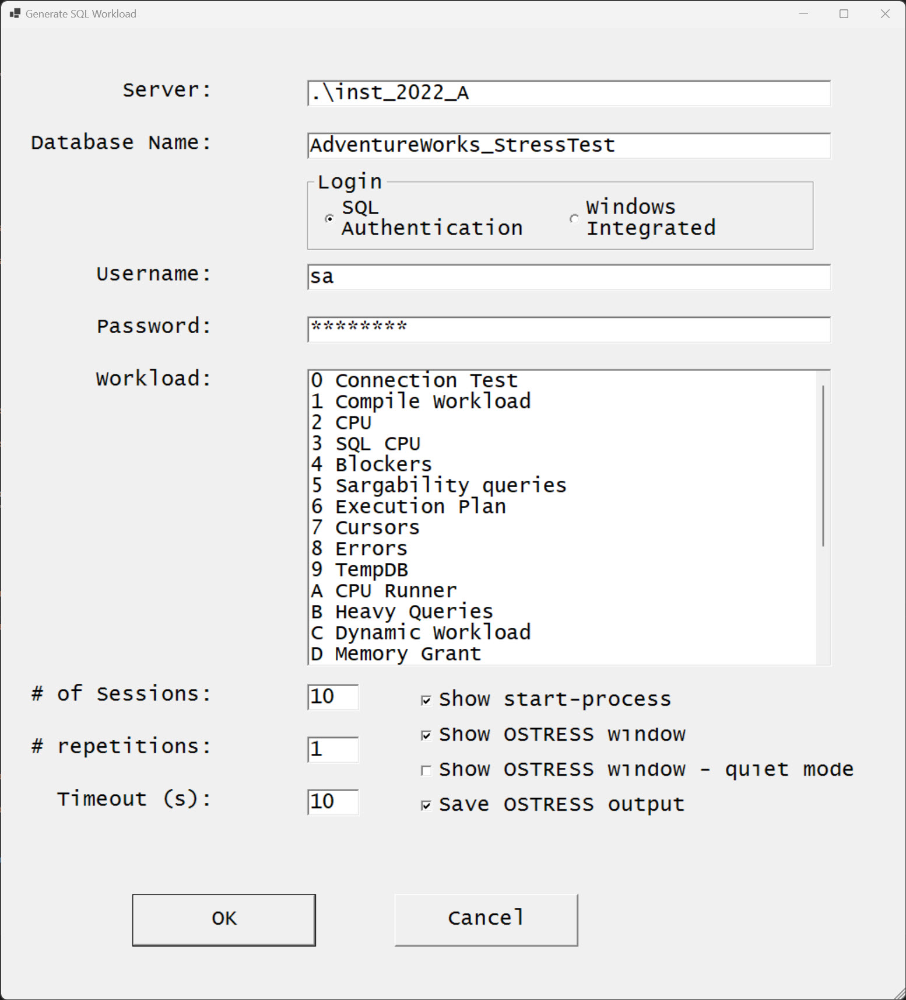

# SQL workload generator

## Tool Definition

DBWatcher_Generate_Workload is a combination of resources to allow a DBA to generate workload on a SQL Server database. The resources are:

* a series of T-SQL scripts, each one used to target a specific area of SQL Server

* OSTRESS ( part of the [RML utilities](https://www.microsoft.com/en-us/download/104868) ) is used to connect to SQL Server and execute the T-SQL Scripts. It allows for:

    * multiple sessions in parallel. If left empty this script will use 1 session

    * the number of repetitions each session will execute.  If left empty this script will use 1 repetition

    * Connection Timeout.  If left empty this script will use 10 seconds

    * a folder to contain the output of OSTRESS execution

        * output are stored in foldername that easily identify the workload

The target  SQL Server instance can be:

* an on-premise SQL Server running on a physical server or a VM

* a SQL Server instance running on a VM in the cloud

* An Azure SQL Database

* An Azure SQL Managed Instance

The T-SQL scripts used to generate workload are based on the **AdventureWorks** sample database. Please read the [pre-requisites](prerequisites.md) to find how to download the sample.

## GUI Description

* Server: enter the complete server name

    * IP address

    * Servername

    * Servername,port

* Database Name: Thename given to the restore AdventureWorks database

* Username: a valid login to the database, with read/write permissions

* Password: the corresponding password to the username entered above

* Workload: a list of existing workload simulations

* Sessions: the number of sessions in parallel to be launched.

* repetitions: the number of executions each session will repeat.

* Timeout: the timeout in seconds for the session to login

* debug start-process: if checked, the terminal will print the command used to generate the stress

* show STRESS: if checked, the window showing the execution will be opened in normal size, otherwise minimized

## Executing the tool

The image below illustrates a connection to a local named instance. It also shows a custom database name for the AdventureWOrksOLTP database.

The value for the password is masked.

For this simmulation, we will validate the tool can connect to that instance, thus the selected workload is "0 Connection Test"

We left the 2 checkboxes checked, which will allow us the see execution details in the next images

* this image shows the output on PowerShell Console

    *the 1st highlighted section shows the ServerName, the Username, and the placeholder for password
    *the 2nd highlighted section shows the parameters used for sessions/repetitions/timeout

* this image shows the OSTRESS output

* this image shows the folder containing OSTRESS output

* this image shows the OSTRESS.log file

